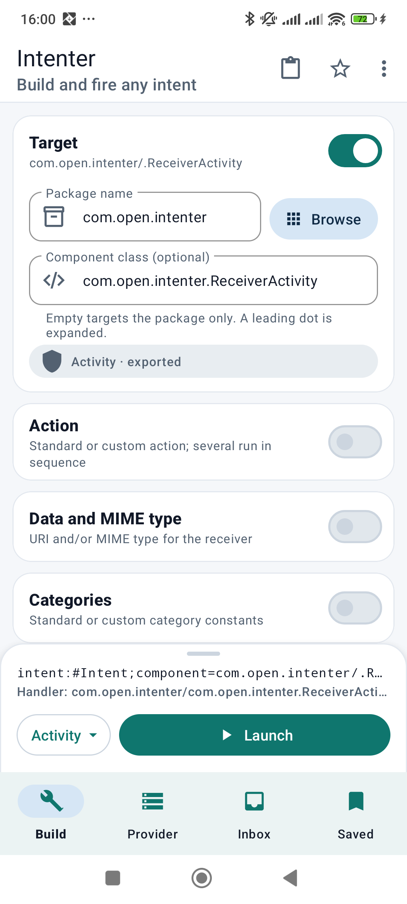
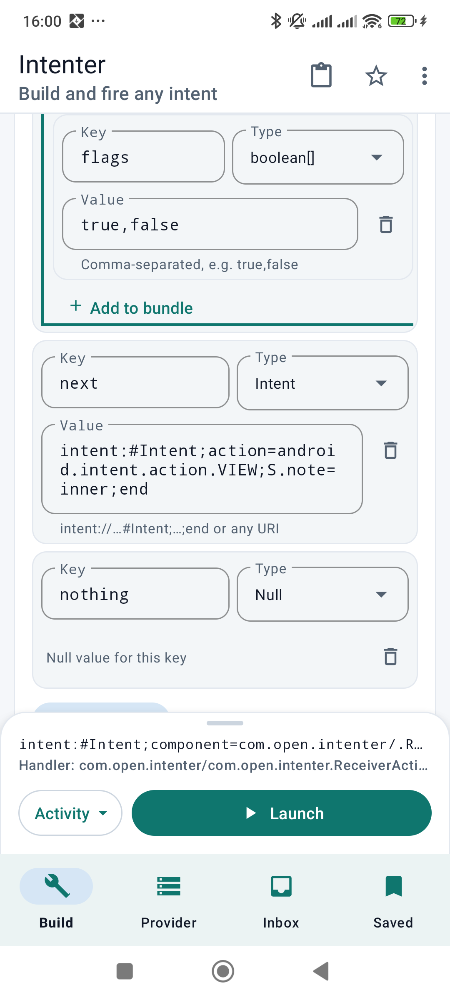
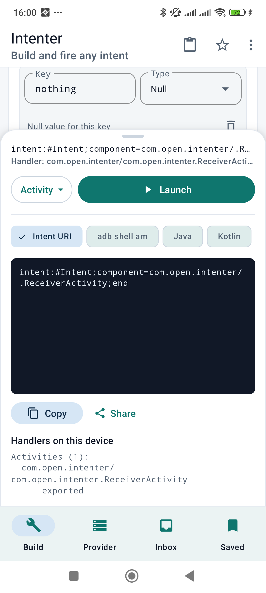
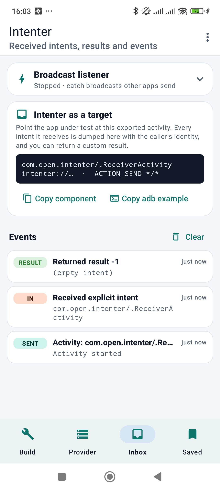
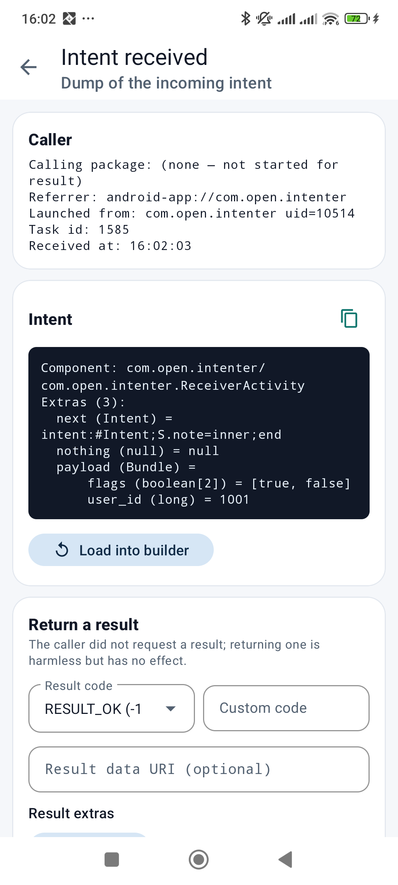
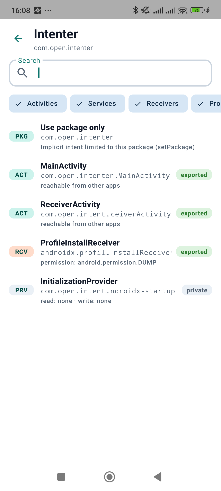
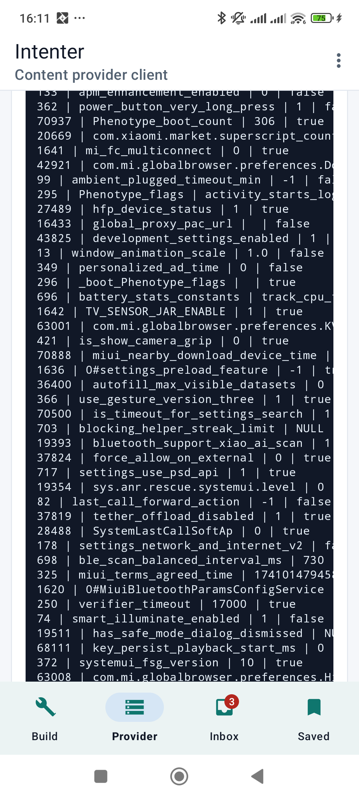
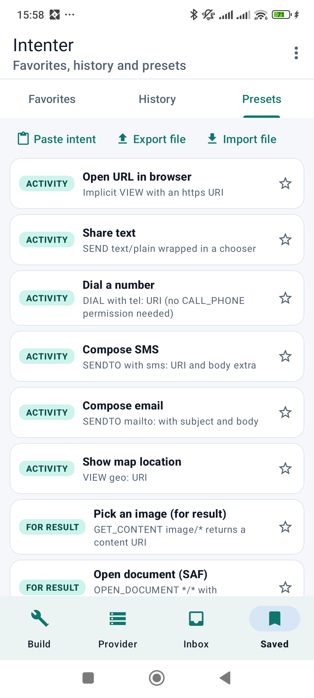

# Intenter

Build, preview and fire **any Android intent** from one app, so QC and IPC testing of another app never requires writing a throwaway test app.

| Build | Extras | Preview & export | Inbox |
|---|---|---|---|
|  |  |  |  |

| Receiver activity | Component picker | Provider client | Presets |
|---|---|---|---|
|  |  |  |  |

## Tabs

### Build
Every part of an `Intent`, each in its own switchable section:

- **Target** – package + class (explicit) or package only. *Browse* opens a picker that lists every app and all of its activities, services, receivers and providers with their `exported` state and required permission. The picked component's kind/export state is shown live under the field.
- **Action** – standard or custom; several actions fire in sequence.
- **Data and MIME** – URI + type, with scheme quick-chips.
- **Categories**.
- **Extras** – typed key/value rows: `String, CharSequence, Integer, Long, Short, Byte, Char, Boolean, Float, Double, Uri, ComponentName, Intent (from an intent:// URI), Bundle (nested, unlimited depth), Null, String[], int[], long[], boolean[], float[], double[], short[], byte[] (hex / csv / utf8), char[], CharSequence[], Uri[], ArrayList<String|Integer|CharSequence|Uri>`. *From JSON* converts a JSON object into typed extras.
- **ClipData** – text, HTML, URI or intent items.
- **Flags** – grouped chips (activity / URI grant / receiver / other) plus raw hex, decimal or `FLAG_…` names; the effective mask is shown.
- **Chooser** and **Advanced** (receiver permission for broadcasts, `Intent.setIdentifier`).

The bottom sheet shows the live intent URI and which components on the device would handle it. Expand it for the full export in **Intent URI**, **adb shell am**, **Java**, **Kotlin** or **JSON**, with copy/share.

Launch modes: Activity · Activity for result · Start service · Foreground service · Stop service · Bind service (connections are kept and can be unbound) · Broadcast · Ordered broadcast (result code/data/extras are collected) · Resolve only (dry run listing all matching components).

Toolbar: paste/import (intent URI, `am` command, plain URI or JSON), save as favorite, clear. The form is kept as a draft across restarts.

### Provider
Content-provider client: `query` (rendered as a table), `insert` / `update` with typed `ContentValues`, `delete`, `call(method, arg, extras)`, `getType` and `openInputStream` (text / hex preview). The owner, export state and read/write permissions of the authority are shown as you type.

### Inbox
Everything that comes back or in:

- Activity results, ordered-broadcast results, service connection events, provider results and errors.
- **Broadcast listener** – register for any set of actions (optionally a data scheme), exported or app-only, with optional result code / abort for ordered broadcasts.
- **Intenter as a target** – the exported `com.open.intenter/.ReceiverActivity` accepts `VIEW intenter://…`, `SEND`/`SEND_MULTIPLE */*`, `PROCESS_TEXT`, `com.open.intenter.action.RECEIVE` and any explicit intent. It dumps the intent with types, shows the caller identity (calling package, referrer, launched-from uid), checks URI grants, and can return any result code, data URI and extras.

Any received intent or result can be loaded straight into the builder for replay.

### Saved
Favorites (named), launch history, built-in presets, JSON file export/import.

## Build & test

```bash
./gradlew assembleDebug            # needs local.properties with sdk.dir
./gradlew testDebugUnitTest        # JUnit + Robolectric (builder, codec, model, dumper)
./gradlew connectedDebugAndroidTest
```

Example: point adb at the receiver activity and watch the dump appear in Inbox:

```bash
adb shell am start -n com.open.intenter/.ReceiverActivity \
  -a android.intent.action.VIEW -d 'intenter://echo?x=1' --es hello world --ei n 7
```
